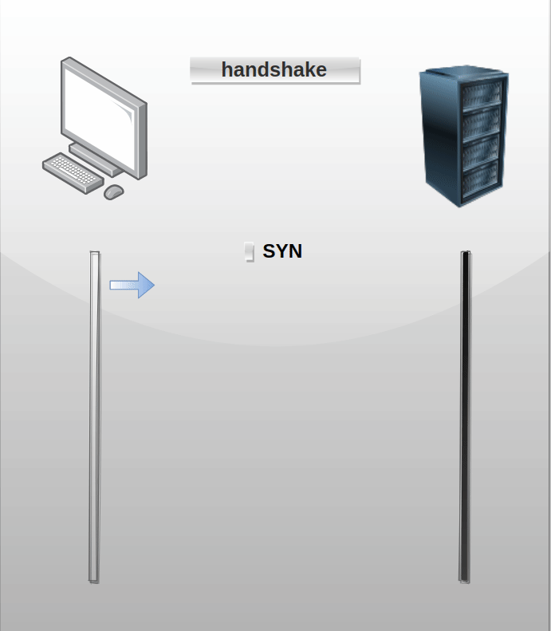
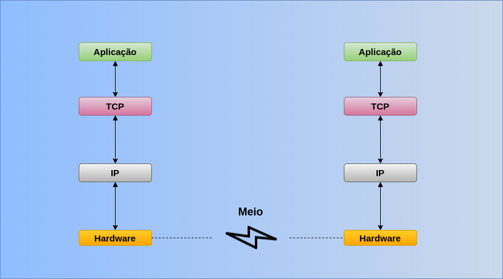

<p align="center">
  
</p>

# _Socket TCP_

## Tópicos
* [Introdução](#introdução)
* [Implementação](#implementação)
* [launch_processes](#launch_processes)
* [button_interface](#button_interface)
* [led_interface](#led_interface)
* [Compilando, Executando e Matando os processos](#compilando-executando-e-matando-os-processos)
* [Compilando](#compilando)
* [Clonando o projeto](#clonando-o-projeto)
* [Selecionando o modo](#selecionando-o-modo)
* [Modo PC](#modo-pc)
* [Modo RASPBERRY](#modo-raspberry)
* [Executando](#executando)
* [Interagindo com o exemplo](#interagindo-com-o-exemplo)
* [MODO PC](#modo-pc-1)
* [MODO RASPBERRY](#modo-raspberry-1)
* [Matando os processos](#matando-os-processos)
* [Conclusão](#conclusão)
* [Referência](#referência)

## Introdução
Até o momento nos referimos a IPC's que permite a comunicação entre processos em uma mesma máquina, o que não é o caso de _socket_. _Sockets_ é um tipo de IPC muito especial, para não dizer o melhor, esse IPC permite a comunicação entre dois processos na mesma máquina, bem como a comunicação entre dois processos em máquinas diferentes atráves de uma rede, ou seja, dois processos rodando em computadores fisicamente separados. Um socket é um dispositivo de comunicação bidirecional, sendo possível enviar e receber mensagens. Para entender de forma fácil o que seria o _socket_, é fazer uma analogia com uma ligação telefônica, você deseja ligar para uma determinado número, então disca esse número e quando a conexão é estabelecida começa a tocar no telefone na outra ponta, a pessoa atende e começam a conversar, o mesmo ocorre para o _socket_, porém ao invés de usar número usamos IP e porta para estabelecer a comunicação. Este IPC possui duas formas de comunicação(não irei mencionar as outras devido não serem tão utilizadas) conhecidas como TCP(Transmission Control Protocol) nesse caso as mensagens são enviadas na forma de _stream_ de mensagens, e UDP(User Datagram Protocol) onde as mensagens são enviadas em blocos de mensagens. Nesse artigo iremos abordar o TCP.


## TCP
O Assunto sobre TCP é imenso, por isso iremos nos limitar somente ao funcionamento desse IPC, ou seja, na sua aplicação, caso queria saber mais como o protocolo funciona, nas referências consta a bibliografia utilizada.
O TCP é considerado um protocolo confiável, pois provê garantia de entrega das mensagens, e de forma ordenada, roda sobre o protocolo IP, e sendo ele um protocolo orientado a conexão, necessita de uma troca de dados iniciais entre os envolvidos para estabelecer uma conexão TCP, conhecido como _handshake_, o cliente envia um SYN para o servidor, então o servidor responde com um SYN ACK e por fim o cliente responde com um ACK.

<p align="center">
  
</p>

O TCP permite conexões entre processos em máquinas distintas, dessa forma podemos atribuir funções para cada uma dessas máquinas, caracterizando uma aplicação distribuída, onde cada possui uma responsabilidade dentro da aplicação. A figura abaixo demonstra a conexão entre duas máquinas:

<p align="center">
  
</p>

Normalmente a arquitetuta mais empregada para esse protocolo é o Cliente/Servidor

## Conceito de servidor
Pela definição do dicionário servidor é um computador que disponibiliza informação e serviços a outros computadores ligados em rede, dessa forma sempre deve estar disponível, para que quando desejado o acesso a ele sempre seja possível.

## Conceito de cliente
Cliente é um computador que consome os serviços e informações de um servidor, podendo ser interno ou pela rede de computadores

## _System Calls utilizados no TCP_ 

Para criar uma aplicação utilizando TCP utilizamos com conjunto bem específico de funções, sendo elas descritas a seguir:


Cria um endpoint para estabelecer uma comunicação
```c
#include <sys/types.h>
#include <sys/socket.h>

int socket(int domain, int type, int protocol);
```

Faz a junção da porta com o socket
```c
#include <sys/types.h>
#include <sys/socket.h>

int bind(int sockfd, const struct sockaddr *addr, socklen_t addrlen);
```

Entra no modo de escuta, aguardando conexões
```c
#include <sys/types.h>
#include <sys/socket.h>

int listen(int sockfd, int backlog);
```

Quando uma conexão é requisitada realiza a aceitação, estabelecendo a conexão
```c
#include <sys/types.h>
#include <sys/socket.h>

int accept(int sockfd, struct sockaddr *addr, socklen_t *addrlen);

```

Solicita uma comunicação
```c
#include <sys/types.h>
#include <sys/socket.h>

int connect(int sockfd, const struct sockaddr *addr, socklen_t addrlen);
```

Com a conexão estabelecida, permite o envio de mensagens para o endpoint receptor
```c
#include <sys/types.h>
#include <sys/socket.h>

ssize_t send(int sockfd, const void *buf, size_t len, int flags);
```

Com a conexão estabelecida, permite receber mensagens do endpoint emissor
```c
#include <sys/types.h>
#include <sys/socket.h>

ssize_t recv(int sockfd, void *buf, size_t len, int flags);
```

Solicita o fim de recepção de novas mensagens
```c
#include <sys/socket.h>

int shutdown(int sockfd, int how);
```

Destroí o socket
```c
#include <unistd.h>

int close(int fd);
```

## Criando um socket Servidor
Para a criação de uma conexão para servidor é necessário seguir alguns passos:
1. Criar um socket
2. Realizar um bind com a porta especificada
3. Iniciar a escuta de requisições de novas conexões
4. Estabelecer a conexão 
5. Realizar a comunicação entre o servidor e o cliente

## Criando um socket Cliente
Para a criação de uma conexão para cliente é necessário seguir alguns passos:
1. Criar um socket
2. Solicitar a conexão
3. Realizar a comunicação entre o cliente e o servidor

## Destruindo um socket Servidor/Cliente
1. Interromper a troca de mensagens
2. Realizar o fechamento do socket

## Preparação do Ambiente
Antes de apresentarmos o exemplo, primeiro precisaremos instalar algumas ferramentas para auxiliar na análise da comunicação. As ferramentas necessárias para esse artigo são o tcpdump e o netcat(nc), para instalá-los basta executar os comandos abaixo:

```bash
sudo apt-get update
```

```bash
sudo apt-get install netcat
```

```bash
sudo apt-get install tcpdump
```

## netcat
O netcat é uma ferramenta capaz de interagir com conexões UDP e TCP, podendo abrir conexões, e ouvindo como um servidor, ou enviar mensanges para um servidor.

## tcpdump
O tcpdump é uma ferramenta capaz de monitorar o tráfego de dados em uma dada interface como por exemplo eth0, com ele é possível analisar os pacotes que são recebido e enviados.


## Implementação

Para demonstrar o uso desse IPC, iremos utilizar o modelo Cliente/Servidor, onde o processo Cliente(_button_process_) vai enviar uma mensagem com comandos pré-determinados para o servidor, e o Servidor(_led_process_) vai ler as mensagens e verificar se possui o comando cadastrado, assim o executando.
Para melhor isolar as implementações do servidor e do cliente foi criado uma biblioteca, que abstrai a rotina de inicialização e execução do servidor, e a rotina de conexão por parte do cliente.

### Biblioteca
A biblioteca criada permite uma fácil criação do servidor, sendo o servidor orientado a eventos, ou seja, fica aguardando as mensagens chegarem.

#### tcp_interface.h
Primeiramente criamos uma interface resposável por eventos de envio e recebimento, essa funções serão chamadas quando esses eventos ocorrerem.

```c
typedef struct 
{
    int (*on_send)(char *buffer, int *size, void *user_data);  
    int (*on_receive)(char *buffer, int size, void *user_data);
} TCP_Callback_t;
```

#### tcp_server.h

Criamos também um contexto que armazena os paramêtros utilizados pelo servidor, sendo o _socket_ para armazenar a instância criada, _port_ que recebe o número que corresponde onde o serviço será disponibilizado, _buffer_ que aponta para a memória alocada previamente pelo usuário, *buffer_size* o representa o tamanho do _buffer_ e a interface das funções de _callback_

```c
typedef struct
{
    int socket;
    int port;
    char *buffer;
    int buffer_size;
    TCP_Callback_t cb;
} TCP_Server_t;
```

Essa função realiza os passos de 1 a 3 previamente descritos, para a inicilização do servidor
```c
bool TCP_Server_Init(TCP_Server_t *server);
```

Essa função aguarda uma conexão e realiza a comunicação com o cliente.
```c
bool TCP_Server_Exec(TCP_Server_t *server, void *data);
```
#### tcp_server.c

No TCP_Server_Init definimos algumas váriaveis para auxiliar na inicialização do servidor, sendo uma variável booleana que representa o estado da inicialização do servidor, uma variável do tipo inteiro que recebe o resultado das funções necessárias para a configuração, uma variável do tipo inteiro para habilitar o reuso da porta caso o servidor precise reiniciar e um estrutura sockaddr_in que é usada para configurar o servidor para se comunicar através da rede.
```c
bool status = false;
int is_valid;
int enable_reuse = 1;
struct sockaddr_in address;
```
Para realizar a inicialização é criado um dummy do while, para que quando houver falha em qualquer uma das etapas sair da função com status de erro, nesse ponto verificamos se o contexto e o buffer foi inicializado, que é de reponsabilidade do usuário

```c
if(!server || !server->buffer)
    break;
```
Criamos um endpoint com o perfil de se conectar via protocolo IPv4(AF_INET), do tipo stream que caracteriza o TCP(SOCK_STREAM), o último parâmetro pode ser 0 nesse caso.
```c
server->socket = socket(AF_INET, SOCK_STREAM, 0);
if(server->socket < 0)
    break;
```
Aqui permitimos o reuso do socket caso necessite reiniciar o serviço
```c
is_valid = setsockopt(server->socket, SOL_SOCKET, SO_REUSEADDR, (void *)&enable_reuse, sizeof(enable_reuse));
if(is_valid < 0)
    break;
```

Preenchemos a estrutura com parâmetros fornecidos pelo usuário como em qual porta que o serviço vai rodar.
```c
memset(&address, 0, sizeof(address));

address.sin_family = AF_INET;
address.sin_addr.s_addr = htonl(INADDR_ANY);
address.sin_port = htons(server->port);
```

Aplicamos as configurações ao socket criado
```c
is_valid = bind(server->socket, (struct sockaddr *)&address, sizeof(address));
if(is_valid != 0)
    break;
```

Por fim colocamos o socket para escutar novas conexões
```c
is_valid = listen(server->socket, 1);
if(is_valid < 0)
    break;

status = true;
```

Na função TCP_Server_Exec declaramos algumas variáveis para realizar a conexão e comunicação com o cliente

```c
struct sockaddr_in address;
socklen_t addr_len = sizeof(address);
int client_socket;
size_t read_len;
int write_len;    
bool status = false;
```

Quando a conexão é solicitada por parte do cliente, o accept retorna o socket referente a conexão, caso for feita com sucesso
```c
client_socket = accept(server->socket, (struct sockaddr *)&address, &addr_len);
if(client_socket > 0)
```

O Servidor aguarda a troca de mensagem, assim que receber realiza a verificação se o callback para recebimento foi preenchido caso sim, passa o conteúdo para o callback realizar o tratamento.
```c
read_len = recv(client_socket, server->buffer, server->buffer_size, 0);
if(server->cb.on_receive)
{
    server->cb.on_receive(server->buffer, read_len, data);
}
```
Aqui é verificado se o callback para envio foi configurado, dessa forma o buffer e passado para que a implementação prepare a mensagem a ser enviada, e alteramos o status para true, que a comunicação foi feita com sucesso.
```c
if(server->cb.on_send)
{
    server->cb.on_send(server->buffer, &write_len, data);
    send(client_socket, server->buffer, (int)fmin(write_len, server->buffer_size), 0);
}

status = true;
``` 

Interrompemos qualquer nova transação e fechamos o socket usando, concluindo a comunicação
```c
shutdown(client_socket, SHUT_RDWR);
close(client_socket);
``` 

#### tcp_client.h
Criamos também um contexto que armazena os paramêtros utilizados pelo cliente, sendo o _socket_ para armazenar a instância criada, _hostname_ é o ip que da máquina que vai ser conectar, _port_ que recebe o número que corresponde qual o serviço deseja consumir, _buffer_ que aponta para a memória alocada previamente pelo usuário, *buffer_size* o representa o tamanho do _buffer_ e a interface das funções de _callback_

```c
typedef struct 
{
    int socket;
    const char *hostname;
    int port;
    char *buffer;
    size_t buffer_size;
    TCP_Callback_t cb;
} TCP_Client_t;
```

Essa função realiza a conexão, envio e recebimento de mensagens para o servidor configurado
```c
bool TCP_Client_Connect(TCP_Client_t *client, void *data);
```

#### tcp_client.c
Na função TCP_Client_Connect definimos algumas váriaveis para auxiliar na comunicação com o servidor, sendo uma variável booleana que representa o estado da parametrização do cliente, uma variável do tipo inteiro que recebe o resultado das funções necessárias para a configuração, uma estrutura sockaddr_in que é usada para configurar o servidor no qual será conectado, e duas variáveis de quantidade de dados enviados e recebidos.

```c
bool status = false;
int is_valid;
struct sockaddr_in server;
int send_size;
int recv_size;
```
Verificamos se o contexto do cliente, e o buffer estão inicializados
```c
if(!client || !client->buffer || client->buffer_size <= 0)
    break;
```

Criamos um endpoint com o perfil de se conectar via protocolo IPv4(AF_INET), do tipo stream que caracteriza o TCP(SOCK_STREAM), o último parâmetro pode ser 0 nesse caso.
```c
client->socket = socket(AF_INET, SOCK_STREAM, 0);
if(client->socket < 0)
    break;

```
Preenchemos a estrutura com o parâmetros pertinentes ao servidor
```c
server.sin_family = AF_INET;
server.sin_port = htons(client->port);
```

Convertemos o hostname para o endereço relativo ao servidor
```c
is_valid = inet_pton(AF_INET, client->hostname, &server.sin_addr);
if(is_valid <= 0)
    break;
```
Solicitamos a conexão com o servidor previamente configurado, caso ocorra tudo de forma correta alteramos o status para verdadeiro
```c
is_valid = connect(client->socket, (struct sockaddr *)&server, sizeof(server));
if(is_valid < 0)
    break;

status = true;
```

Aqui verificamos se a inicialização ocorreu com sucesso e se o callback para envio foi preenchido
```c
if( status && client->cb.on_send)
```
Em caso de sucesso passamos o contexto para a implementação feita pelo usuário para preparar o dados a ser enviado para o servidor
```c
client->cb.on_send(client->buffer, &send_size, data);
send(client->socket, client->buffer, (int)fmin(send_size, client->buffer_size), 0);
```

Se o callback para o recebimento foi preenchido passamos o contexto para a implementação do usuário tratar a resposta
```c
if(client->cb.on_receive)
{
    recv_size = recv(client->socket, client->buffer, client->buffer_size, 0);
    client->cb.on_receive(client->buffer, recv_size, data);
}
```
Por fim interrompemos qualquer nova transação e fechamos o socket e retornamos o status
```c
shutdown(client->socket, SHUT_RDWR);
close(client->socket);

return status;
```

 A aplicação é composta por três executáveis sendo eles:
* _launch_processes_ - é responsável por lançar os processos _button_process_ e _led_process_ atráves da combinação _fork_ e _exec_
* _button_interface_ - é reponsável por ler o GPIO em modo de leitura da Raspberry Pi e se conectar ao servidor para enviar uma mensagem de alteração de estado.
* _led_interface_ - é reponsável por escutar novas conexões, recebendo comandos para aplicar em um GPIO configurado como saída

### *launch_processes*

No _main_ criamos duas variáveis para armazenar o PID do *button_process* e do *led_process*, e mais duas variáveis para armazenar o resultado caso o _exec_ venha a falhar.
```c
int pid_button, pid_led;
int button_status, led_status;
```

Em seguida criamos um processo clone, se processo clone for igual a 0, criamos um _array_ de *strings* com o nome do programa que será usado pelo _exec_, em caso o _exec_ retorne, o estado do retorno é capturado e será impresso no *stdout* e aborta a aplicação. Se o _exec_ for executado com sucesso o programa *button_process* será carregado. 
```c
pid_button = fork();

if(pid_button == 0)
{
    //start button process
    char *args[] = {"./button_process", NULL};
    button_status = execvp(args[0], args);
    printf("Error to start button process, status = %d\n", button_status);
    abort();
}   
```

O mesmo procedimento é repetido novamente, porém com a intenção de carregar o *led_process*.

```c
pid_led = fork();

if(pid_led == 0)
{
    //Start led process
    char *args[] = {"./led_process", NULL};
    led_status = execvp(args[0], args);
    printf("Error to start led process, status = %d\n", led_status);
    abort();
}
```

### *button_interface*
A implementação do Button_Run ficou simples, onde realizamos a inicialização do interface de botão e ficamos em loop aguardando o pressionamento do botão para alterar o estado da variável e enviar a mensagem para o servidor
```c
bool Button_Run(TCP_Client_t *client, Button_Data *button)
{
    static int state = 0;

    if(button->interface->Init(button->object) == false)
        return false;

    while(true)
    {
        wait_press(button);
        state ^= 0x01;
        TCP_Client_Connect(client, &state);
    }
}
```

### *led_interface*
A implementação do LED_Run ficou simples também, onde realizamos a inicialização da interface de LED, do servidor e ficamos em loop aguardando o recebimento de uma conexão.
```c
bool LED_Run(TCP_Server_t *server, LED_Data *led)
{
    if(led->interface->Init(led->object) == false)
        return false;

    TCP_Server_Init(server);

    while(true)
    {
        TCP_Server_Exec(server, led);
    }

    return false;
}
```

### *button_process*

Definimos uma lista de comandos que iremos enviar
```c
const char *states[] = 
{
    "LED ON",
    "LED OFF"
};
```

A parametrização do cliente fica por conta do processo de botão que inicializa o contexto com o buffer, seu tamanho, o endereço do hostname, o serviço que deseja consumir e os callbacks preenchidos, nesse exemplo usaremos somente o de envio, não estando interessado na recepção, e assim passamos os argumentos para Button_Run iniciar o processo.
```c
TCP_Client_t client = 
{
    .buffer = client_buffer,
    .buffer_size = BUFFER_SIZE,
    .hostname = "127.0.0.1",
    .port = 5555,
    .cb.on_send = on_send        
};

Button_Run(&client, &button);
```
A implementação no evento de envio, recuperamos o estado recebido e alteramos e indexamos com a lista de comando para enviar a mensagem
```c
static int on_send(char *buffer, int *size, void *data)
{
    int *state = (int *)data;
    snprintf(buffer, strlen(states[*state]) + 1, "%s",states[*state]);
    *size = strlen(states[*state]) + 1;

    return 0;
}
```
A parametrização do servidor fica por conta do processo de LED que inicializa o contexto com o buffer, seu tamanho, a porta onde vai servir e os callbacks preenchidos, nesse exemplo usaremos somente o de recebimento, e assim passamos os argumentos para LED_Run iniciar o serviço.
### *led_process*
```c
 TCP_Server_t server = 
    {
        .buffer = server_buffer,
        .buffer_size = sizeof(server_buffer),
        .port = 5555,
        .cb.on_receive = on_receive_message
    };

    LED_Run(&server, &data);
```

A implementação no evento de recebimento da mensagem, compara a mensagem recebida com os comandos internos para o acionamento do LED, caso for igual executa a ação correspondente.

```c
static int on_receive_message(char *buffer, int size, void *user_data)
{
    LED_Data *led = (LED_Data *)user_data;

    if(strncmp("LED ON", buffer, strlen("LED ON")) == 0)
        led->interface->Set(led->object, 1);
    else if(strncmp("LED OFF", buffer, strlen("LED OFF")) == 0)
        led->interface->Set(led->object, 0);

    return 0;
}
```

## Compilando, Executando e Matando os processos
Para compilar e testar o projeto é necessário instalar a biblioteca de [hardware](https://github.com/NakedSolidSnake/Raspberry_lib_hardware) necessária para resolver as dependências de configuração de GPIO da Raspberry Pi.

## Compilando
Para faciliar a execução do exemplo, o exemplo proposto foi criado baseado em uma interface, onde é possível selecionar se usará o hardware da Raspberry Pi 3, ou se a interação com o exemplo vai ser através de input feito por FIFO e o output visualizado através de LOG.

### Clonando o projeto
Pra obter uma cópia do projeto execute os comandos a seguir:

```bash
$ git clone https://github.com/NakedSolidSnake/Raspberry_IPC_Socket_TCP
$ cd Raspberry_IPC_Socket_TCP
$ mkdir build && cd build
```

### Selecionando o modo
Para selecionar o modo devemos passar para o cmake uma variável de ambiente chamada de ARCH, e pode-se passar os seguintes valores, PC ou RASPBERRY, para o caso de PC o exemplo terá sua interface preenchida com os sources presentes na pasta src/platform/pc, que permite a interação com o exemplo através de FIFO e LOG, caso seja RASPBERRY usará os GPIO's descritos no [artigo](https://github.com/NakedSolidSnake/Raspberry_lib_hardware#testando-a-instala%C3%A7%C3%A3o-e-as-conex%C3%B5es-de-hardware).

#### Modo PC
```bash
$ cmake -DARCH=PC ..
$ make
```

#### Modo RASPBERRY
```bash
$ cmake -DARCH=RASPBERRY ..
$ make
```

## Executando
Para executar a aplicação execute o processo _*launch_processes*_ para lançar os processos *button_process* e *led_process* que foram determinados de acordo com o modo selecionado.

```bash
$ cd bin
$ ./launch_processes
```

Uma vez executado podemos verificar se os processos estão rodando atráves do comando 
```bash
$ ps -ef | grep _process
```

O output 
```bash
cssouza  11492  1364  0 13:59 pts/0    00:00:00 ./button_process
cssouza  11493  1364  0 13:59 pts/0    00:00:00 ./led_process
```
## Interagindo com o exemplo
Dependendo do modo de compilação selecionado a interação com o exemplo acontece de forma diferente

### MODO PC
Para o modo PC, precisamos abrir um terminal e monitorar os LOG's
```bash
$ sudo tail -f /var/log/syslog | grep LED
```

Dessa forma o terminal irá apresentar somente os LOG's referente ao exemplo.

Para simular o botão, o processo em modo PC cria uma FIFO para permitir enviar comandos para a aplicação, dessa forma todas as vezes que for enviado o número 0 irá logar no terminal onde foi configurado para o monitoramento, segue o exemplo
```bash
echo "0" > /tmp/tcp_file
```

Output do LOG quando enviado o comando algumas vezez
```bash
Apr 30 14:01:12 dell-cssouza LED TCP[11493]: LED Status: On
Apr 30 14:01:13 dell-cssouza LED TCP[11493]: LED Status: Off
Apr 30 14:01:13 dell-cssouza LED TCP[11493]: LED Status: On
Apr 30 14:01:14 dell-cssouza LED TCP[11493]: LED Status: Off
Apr 30 14:01:14 dell-cssouza LED TCP[11493]: LED Status: On
Apr 30 14:01:19 dell-cssouza LED TCP[11493]: LED Status: Off
```

### MODO RASPBERRY
Para o modo RASPBERRY a cada vez que o botão for pressionado irá alternar o estado do LED.

## Monitorando o tráfego usando o tcpdump
Para monitorar as mensagens que trafegam, precisamos ler uma interface, para saber quais interfaces que o computador possui usamos o comando 
```bash
$ ip a
```
Output
```bash
1: lo: <LOOPBACK,UP,LOWER_UP> mtu 65536 qdisc noqueue state UNKNOWN group default qlen 1000
    link/loopback 00:00:00:00:00:00 brd 00:00:00:00:00:00
    inet 127.0.0.1/8 scope host lo
       valid_lft forever preferred_lft forever
    inet6 ::1/128 scope host 
       valid_lft forever preferred_lft forever
2: enp0s31f6: <BROADCAST,MULTICAST,UP,LOWER_UP> mtu 1500 qdisc fq_codel state UP group default qlen 1000
    link/ether 10:65:30:22:8a:1a brd ff:ff:ff:ff:ff:ff
    inet 10.0.0.100/24 brd 10.0.0.255 scope global dynamic noprefixroute enp0s31f6
       valid_lft 17064sec preferred_lft 17064sec
    inet6 fe80::3b0:2187:f4da:d8cd/64 scope link noprefixroute 
       valid_lft forever preferred_lft forever
3: wlp2s0: <NO-CARRIER,BROADCAST,MULTICAST,UP> mtu 1500 qdisc noqueue state DOWN group default qlen 1000
    link/ether 7c:2a:31:df:f0:02 brd ff:ff:ff:ff:ff:ff
4: vboxnet0: <BROADCAST,MULTICAST,UP,LOWER_UP> mtu 1500 qdisc fq_codel state UP group default qlen 1000
    link/ether 0a:00:27:00:00:00 brd ff:ff:ff:ff:ff:ff
    inet 172.16.11.100/24 brd 172.16.11.255 scope global vboxnet0
       valid_lft forever preferred_lft forever
    inet6 fe80::800:27ff:fe00:0/64 scope link 
       valid_lft forever preferred_lft forever
```

Como podemos ver temos 4 interfaces no computar onde o comando foi executado, pode ser que a máquina que esteja usando possa ter mais interfaces ou menos interfaces. Para teste local, iremos usar a interface local denominada lo

O tcpdump possui opções que permite a visualização dos dados, não irei explicar tudo, fica de estudo para quem quiser saber mais sobre o protocolo TCP. Executando o comando:
```bash
sudo tcpdump -i lo -nnSX port 5555
```
Após executar o comando o tcpdump ficará fazendo sniffing da conexão, dessa forma enviamos um comando e veremos a seguinte saída:

```bash
tcpdump: verbose output suppressed, use -v or -vv for full protocol decode
listening on lo, link-type EN10MB (Ethernet), capture size 262144 bytes
14:03:45.435884 IP 127.0.0.1.44800 > 127.0.0.1.5555: Flags [S], seq 2553339266, win 65495, options [mss 65495,sackOK,TS val 3435397926 ecr 0,nop,wscale 7], length 0
	0x0000:  4500 003c 11f5 4000 4006 2ac5 7f00 0001  E..<..@.@.*.....
	0x0010:  7f00 0001 af00 15b3 9830 dd82 0000 0000  .........0......
	0x0020:  a002 ffd7 fe30 0000 0204 ffd7 0402 080a  .....0..........
	0x0030:  ccc4 0326 0000 0000 0103 0307            ...&........
14:03:45.435898 IP 127.0.0.1.5555 > 127.0.0.1.44800: Flags [S.], seq 463681437, ack 2553339267, win 65483, options [mss 65495,sackOK,TS val 3435397926 ecr 3435397926,nop,wscale 7], length 0
	0x0000:  4500 003c 0000 4000 4006 3cba 7f00 0001  E..<..@.@.<.....
	0x0010:  7f00 0001 15b3 af00 1ba3 379d 9830 dd83  ..........7..0..
	0x0020:  a012 ffcb fe30 0000 0204 ffd7 0402 080a  .....0..........
	0x0030:  ccc4 0326 ccc4 0326 0103 0307            ...&...&....
14:03:45.435911 IP 127.0.0.1.44800 > 127.0.0.1.5555: Flags [.], ack 463681438, win 512, options [nop,nop,TS val 3435397926 ecr 3435397926], length 0
	0x0000:  4500 0034 11f6 4000 4006 2acc 7f00 0001  E..4..@.@.*.....
	0x0010:  7f00 0001 af00 15b3 9830 dd83 1ba3 379e  .........0....7.
	0x0020:  8010 0200 fe28 0000 0101 080a ccc4 0326  .....(.........&
	0x0030:  ccc4 0326                                ...&
14:03:45.435937 IP 127.0.0.1.44800 > 127.0.0.1.5555: Flags [P.], seq 2553339267:2553339275, ack 463681438, win 512, options [nop,nop,TS val 3435397926 ecr 3435397926], length 8
	0x0000:  4500 003c 11f7 4000 4006 2ac3 7f00 0001  E..<..@.@.*.....
	0x0010:  7f00 0001 af00 15b3 9830 dd83 1ba3 379e  .........0....7.
	0x0020:  8018 0200 fe30 0000 0101 080a ccc4 0326  .....0.........&
	0x0030:  ccc4 0326 4c45 4420 4f46 4600            ...&LED.OFF.
```

Podemos ver claramente que há o handshake, no instante 14:03:45.435884 IP 127.0.0.1.44800 > 127.0.0.1.5555, o cliente envia uma SYN para o server, no instante 14:03:45.435898 IP 127.0.0.1.5555 > 127.0.0.1.44800, o servidor responde com um SYN ACK, no instante 14:03:45.435911 IP 127.0.0.1.44800 > 127.0.0.1.5555, o cliente envia um ACK para o servidor e por fim o cliente envia a mensagem podendo ser vista no fim da ultima mensagem LED.OFF.

## Testando conexão com o servidor via netcat
A aplicação realiza a comunicação entre processos locais, para testar uma comunicação remota usaremos o netcat que permite se conectar de forma prática ao servidor e enviar os comandos. Para se conectar basta usar o seguinte comando:

```bash
$ nc ip port
```

Como descrito no comando ip usaremos o ip apresentado na interface enp0s31f6 que é o IP 10.0.0.100, então o comando fica
```bash
$ nc 10.0.0.100 5555
```
E enviamos o comando LED ON, se visualizar no log irá apresentar que o comando foi executado

## Matando os processos
Para matar os processos criados execute o script kill_process.sh
```bash
$ cd bin
$ ./kill_process.sh
```

## Conclusão
Esse sem dúvida é o melhor IPC, pois permite a comunicação entre processos na mesma máquina e em máquinas fisicamente separadas, também é possível se comunicar com outras tecnologias, baseado em um protocolo padrão, além disso, permite outras utilizades como comunicação entre threads para evitar concorrências, criação de padrões arquiteturais como cliente/servidor utilizado nessa aplicação, bem como o a criação do Zeromq, porém toda essa facilidade, geramos um grande problema quando precisamos trafegar os dados em uma rede pública, quando feito dessa forma estamos expondo os nossos dados, como visto no tcpdump, mas existe uma forma de protegê-los. 

## Referência
* [Link do projeto completo](https://github.com/NakedSolidSnake/Raspberry_IPC_Socket_TCP)
* [Mark Mitchell, Jeffrey Oldham, and Alex Samuel - Advanced Linux Programming](https://www.amazon.com.br/Advanced-Linux-Programming-CodeSourcery-LLC/dp/0735710430)
* [fork, exec e daemon](https://github.com/NakedSolidSnake/Raspberry_fork_exec_daemon)
* [biblioteca hardware](https://github.com/NakedSolidSnake/Raspberry_lib_hardware)

